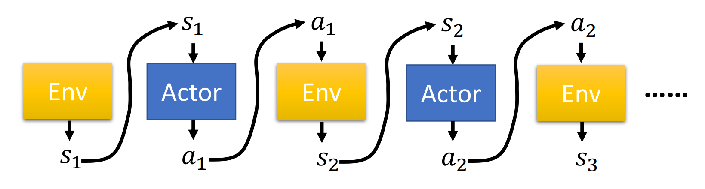

## Policy Gradient

### Policy

Policy 𝜋 is a network with parameter 𝜃 

- Input: the observation of machine represented as a vector or a matrix
- Output: each action corresponds to a neuron in output layer

### Trajectory

- Trajectory $$\tau = \{{s_1, a_1, s_2, a_2, \cdots, s_T, a_T}\} $$​

- Probability of $\tau$ 
  $$
  \begin{equation}
  \begin{split}   
    p_{\theta}(\tau)&= p(s_1)p_{\theta}(a_1|s_1)p(s_2|s_1, a_1)p_{\theta}(a_2|s_2)p(s_3|s_2, a_2)\cdots \\
    &=p(s_1)\prod_{t=1}^{T} p_{\theta}(a_t|s_t)p(s_{t+1}|s_t, a_t)
  \end{split}
  \end{equation}
  $$

- Expected reward 
  $$
  \bar{R}_{\theta} = \sum_{\tau} R(\tau)p_{\theta}(\tau)
  $$

??? note
    Target : find an actor to maximize the expectation of accumulating reward $\bar{R}_{\theta}$

### Policy gradient

- Calculate grad
  $$
  \begin{equation}
  \begin{split}
    {\nabla}{\bar{R}_{\theta}}&= \nabla \sum_{\tau} R(\tau)p_{\theta}(\tau) \\
    &= \sum_{\tau} R(\tau){\nabla}p_{\theta}(\tau) \\
    &= \sum_{\tau} R(\tau)p_{\theta}(\tau){\nabla}\log p_{\theta}(\tau) \\
    &= E_{\tau\thicksim p_{\theta}(\tau)} [R(\tau)\nabla\log p_{\theta}(\tau)] \approx \frac{1}{N} \sum_{n=1}^{N} R({\tau}^n)\nabla\log p_{\theta}({\tau}^n) \\
    &= \frac{1}{N} \sum_{n=1}^{N} \sum_{t=1}^{T_n} R({\tau}^n)\nabla \log p_{\theta}(a_t^n \mid s_t^n)
  \end{split}
  \end{equation}
  $$

- Update model
  $$
  \theta \leftarrow \theta+\eta\nabla\bar{R}_{\theta}
  $$

### Implementation

- Tip1: Add a baseline
  $$
    {\nabla}{\bar{R}_{\theta}}\approx \frac{1}{N} \sum_{n=1}^{N} \sum_{t=1}^{T_n} (R({\tau}^n)-b)\nabla \log p_{\theta}(a_t^n \mid s_t^n) \\
    b \approx E[R(\tau)]
  $$
- Tip2: Assign suitable credit
  $$
    {\nabla}{\bar{R}_{\theta}}\approx \frac{1}{N} \sum_{n=1}^{N} \sum_{t=1}^{T_n} (\sum_{t'=t}^{T_n} {r_{t'}^n}-b)\nabla \log p_{\theta}(a_t^n \mid s_t^n) \\
  $$

